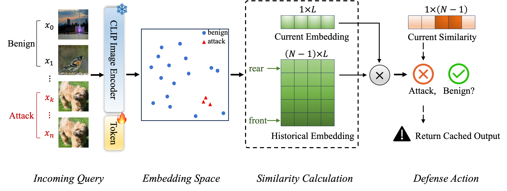
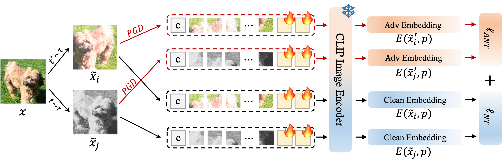

# AdvQDet: Detecting Query-Based Adversarial Attacks with Adversarial Contrastive Prompt Tuning

Official PyTorch implementation of the following paper:

AdvQDet: Detecting Query-Based Adversarial Attacks with Adversarial Contrastive Prompt Tuning, ACM MM 2024.

--- 

The core of detecting query-based attack, such as Boundary, HSJA, and NESS, is training a robust feature extractor that always produces similar feature vectors for any two adversarial queries crafted from the same image, even for adaptive attacks..

In light of this, we propose a simple yet effective framework, Adversarial Contrastive Prompt Tuning (ACPT), to train reliable feature extractors for accurate and robust detection of query-based attacks.
